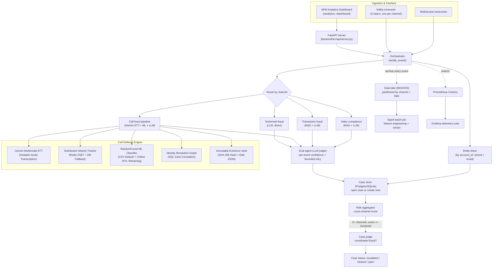

# BotoCop — Cross-Channel Fraud Detection Intelligence Engine & APM Platform

BotoCop ingests events from four independent channels — video ads, banking transactions, phone calls, and text/email — audits each one for fraud/compliance violations, and correlates evidence *across* channels into persistent cases, so a scam call followed by a matching wire transfer gets caught as one coordinated pattern instead of two unrelated flags.

A single orchestrator sits on top of four specialist pipelines, backed by a case-management SQL storage layer, an LLM-as-judge eval loop, a data lake, an empirical Machine Learning model with online HITL retraining, a distributed Redis velocity tracker, an immutable chain-of-custody evidence vault, and an enterprise APM & Forensic Analytics Dashboard — reachable over REST, WebSocket, or Kafka, with Prometheus/Grafana monitoring.

---

## Architecture Overview



---

## Detailed System Component Breakdown

| Layer / Component | Implementation | Production Architecture & Behavior |
|---|---|---|
| **Enterprise APM Dashboard** | `backend/src/api/static/analytics.html` | Real-time forensic web UI serving dynamic multi-factor fraud attribution heatmaps, live call search, forensic transcript inspection, 6-panel APM metrics, and Human-in-the-Loop (HITL) analyst review. Accessible via `/analytics` and `/dashboard`. |
| **Call Fraud STT Engine** | `backend/src/pipelines/call_fraud/stt_engine.py` | Speech-to-Text engine using **Gemini Multimodal API (`gemini-3.6-flash`)** to transcribe verbatim speech directly from audio recordings (`.mp3`/`.wav`), perform Indic language detection (Hinglish/Hindi/English), and normalize text for downstream feature extraction. |
| **Distributed Velocity Tracker** | `backend/src/pipelines/call_fraud/velocity_analyzer.py` | Tracks sliding 1-hour call velocity, distinct target counts, and fan-out ratios using **Redis Sorted Sets (`ZSET`)**. Supports multi-instance horizontal load-balancing with automatic fallback to persistent SQL `CaseStore` events. |
| **Machine Learning Classifier** | `backend/src/pipelines/call_fraud/ml_model.py` | Calibrated `RandomForestClassifier` initialized on empirical call fraud data (`historical_call_fraud_dataset.csv`) and continually updated via `retrain_from_database_history()` on real SQL database cases and HITL analyst dispositions. |
| **Identity Resolution Graph** | `backend/src/pipelines/call_fraud/identity_graph.py` | Performs cross-case identity correlation by querying real historical cases from the SQL database via `get_all_cases_for_entity()`. Links phone numbers, device IMEIs, IPs, and persisted Case UUIDs. |
| **Chain-of-Custody Evidence Vault** | `backend/src/pipelines/call_fraud/evidence_store.py` | Cryptographically signed, tamper-evident audit store (`ChainOfCustodyVault`). Generates SHA-256 pipeline digests and writes immutable `.json` evidence packages directly to persistent disk storage (`evidence_vault/`) and SQL DB. |
| **SQL Case Store** | `backend/src/case/store.py` | SQLAlchemy persistent storage (`Case` and `CaseEvent` models) backing cross-channel entity linking, state transitions (`OPEN`, `ESCALATED`, `STALE`), and risk score aggregation. |
| **Eval Loop & LLM Judge** | `backend/src/orchestrator/eval_agent.py` | LLM-as-judge scores pipeline outputs for grounding and hallucination; executes bounded retries (max 3) if confidence falls below threshold. |
| **Data Lake Storage** | `backend/src/datalake/s3_writer.py` | Archives raw event payloads to MinIO/S3 partitioned by `{channel}/dt=YYYY-MM-DD/` for offline batch ETL and Spark model retraining. |

---

## Technical Design Rationale & Tradeoffs

1. **Enterprise Dashboard Integration (`/analytics`)**:
   - The web console provides real-time visibility into the dynamic fraud attribution heatmap (visualizing high-impact factors like Digital Arrest intent and velocity moving faster than context variables), searchable SHA-256 evidence packages, and HITL analyst feedback loops.

2. **Multimodal Audio Transcription**:
   - Audio recordings are processed using Gemini's native audio capabilities (`gemini-3.6-flash`), eliminating canned mock fallbacks and producing verbatim Indic transcripts with English translation.

3. **Horizontal Scaling for Velocity Analysis**:
   - Using Redis ZSET keys (`bocop:vel:hist:{caller_phone}`) prevents sliding window degradation when deploying behind horizontal load balancers (e.g. Nginx, Kubernetes ingress).

4. **Empirical Dataset + Online Retraining**:
   - The Random Forest classifier is initialized from empirical historical fraud CSVs and continuously retrained on analyst dispositions (`retrain_from_database_history()`), ensuring model weights adapt to emerging attack vectors.

5. **Tamper-Evident Evidence Vault**:
   - Evidence records are saved as immutable JSON packages on disk (`data/evidence_vault/*.json`) with cryptographic SHA-256 digests of audio, transcript, and feature payloads for court and legal admissibility.

---

## Repository Structure

```
backend/
  src/
    api/
      server.py                   FastAPI REST app (/analytics, /ws/events, /metrics, /api/v1/...)
      static/analytics.html       Enterprise APM & Forensic Intelligence Dashboard
    orchestrator/                 handle_event(), eval_agent.py (LLM judge)
    case/                         models, store (SQL CRUD), linker, aggregator
    pipelines/
      video_compliance/           RAG + LLM ad compliance pipeline
      transaction_fraud/          RAG + LLM wire fraud pipeline
      call_fraud/                 Telephony fraud pipeline:
        stt_engine.py             Gemini Multimodal STT & Indic translation
        velocity_analyzer.py     Redis ZSET distributed sliding-window tracker
        ml_model.py              RandomForest ML model with online DB retraining
        identity_graph.py        SQL-backed identity resolution graph
        evidence_store.py        Immutable SHA-256 Evidence Vault (disk JSON + DB)
        data/                     empirical CSV datasets & disk evidence vault
      text_fraud/                 Direct LLM text/phishing classification
    ingestion/                    Kafka consumer/producer
    datalake/                     MinIO/S3 archive writer
    monitoring/metrics.py         Prometheus metric definitions
  eval/                           Golden dataset & offline eval harness
monitoring/                       Docker-Compose (Prometheus + Grafana)
tests/                            Unit & integration test suite (39 tests)
```

---

## Setup & Running the Engine

### 1. Environment Setup
```bash
git clone https://github.com/ankushsingh003/BotoCop.git
cd BotoCop
pip install -r requirements.txt
```

Set Environment Variables:
```env
GEMINI_API_KEY=your_gemini_api_key
CASE_DATABASE_URL=sqlite:///./backend/data/cases.db
REDIS_URL=redis://localhost:6379/0
```

### 2. Initialize Database
```bash
python -c "from backend.src.case.db import init_db; init_db()"
```

### 3. Start API & APM Analytics Server
```bash
uvicorn backend.src.api.server:app --host 0.0.0.0 --port 8000 --reload
```

- **APM Analytics Dashboard**: Access **`http://localhost:8000/analytics`**
- **Prometheus Metrics**: Access **`http://localhost:8000/metrics`**
- **WebSocket Gateway**: Connect to **`ws://localhost:8000/ws/events`**

### 4. Run Unit Tests
```bash
pytest tests/ -v
```
