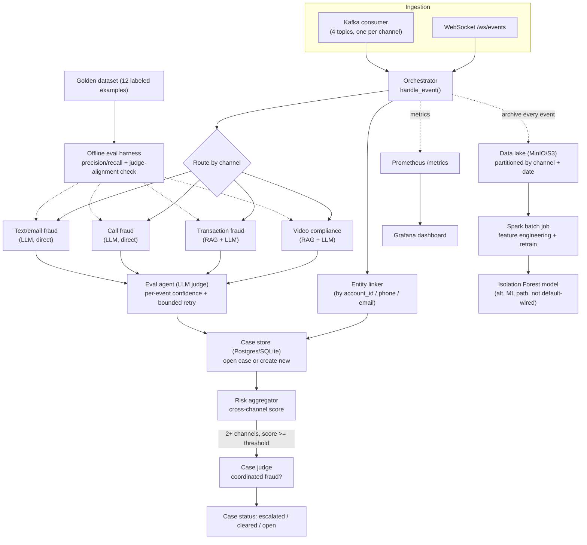

# BotoCop — Cross-Channel Fraud Detection Intelligence Engine

BotoCop ingests events from four independent channels — video ads, banking
transactions, phone calls, and text/email — audits each one for
fraud/compliance violations, and correlates evidence *across* channels into
persistent cases, so a scam call followed by a matching wire transfer gets
caught as one coordinated pattern instead of two unrelated flags.

A single orchestrator sits on top of four specialist pipelines, backed by a
case-management layer, an LLM-as-judge eval loop, a data lake, and a
Spark-based batch retraining job — reachable over WebSocket or Kafka, with
Prometheus/Grafana monitoring and an offline eval harness with a golden
dataset.

## Architecture



## What each layer actually does

| Layer | What it does | Why |
|---|---|---|
| **Orchestrator** | Single entry point (`handle_event`) for every event regardless of how it arrived | WebSocket and Kafka both call the exact same function — no duplicated logic between ingestion paths |
| **Case layer** | Links events to a persistent case by entity ID, stores a timeline | Cases can stay open for days waiting for the next signal — this has to be real storage, not in-memory state |
| **Eval agent** | LLM-as-judge scores each pipeline result; bounded retry (max 3) if not confident | Catches ungrounded/hallucinated outputs before they reach the case layer |
| **Case judge** | Second-level judge, only invoked once 2+ channels have evidence | Decides whether cross-channel evidence is one coordinated fraud pattern or unrelated coincidence |
| **Data lake** | Every processed event archived, partitioned `{channel}/dt=YYYY-MM-DD/` | Makes every live audit into future training data, not a one-off decision that's discarded |
| **Spark job** | Reads the archive, engineers features at scale, hands off to scikit-learn for the final fit | Isolation Forest has no native Spark MLlib implementation — Spark does the part that needs to scale (ETL over the archive), sklearn does the small final fit |
| **Eval harness** | Golden dataset + precision/recall + judge-alignment check | Regression testing for prompt/model changes, and a check on whether the judge's confidence is *correct*, not just how often it fires |
| **Monitoring** | Prometheus metrics + Grafana dashboard | Throughput, violation rate, pipeline latency, retry rate, case transitions, live open-case count |

## Key design decisions (and the tradeoffs behind them)

- **RAG for video and transactions, direct LLM classification for calls and text.** Video and transactions get checked against reference documents (ad-spec PDFs, AML rulebooks) — that's a retrieval task. Calls and text are scam-pattern recognition in free text, which an LLM can do directly without a lookup step.
- **An Isolation Forest transaction model exists but isn't the default.** It was built and tested first (structured numeric data is arguably a better fit for ML anomaly detection than RAG), then explicitly swapped back to RAG-based auditing. It's preserved at `pipelines/transaction_fraud/nodes_ml_isolation_forest.py` — tested, not deleted — because dropping validated work isn't the same as it being wrong for the *chosen* design.
- **MinIO instead of literal HDFS.** Same conceptual role (a data lake feeding batch retraining) but MinIO is S3-API compatible, trivial to run as a single container, and reflects how new systems are actually built today rather than a 2015-era Hadoop pattern.
- **Both WebSocket and Kafka exist, deliberately, not redundantly.** Kafka is the real production ingestion path — decoupled, replayable, backpressure-safe. WebSocket is genuinely useful for direct/interactive use (a demo, a dashboard, a single client). Both call the same orchestrator.
- **Entity linking is scoped, not solved.** Cases are linked by an explicit shared identifier (`account_id`, `phone_number`, `sender_email`) already present in the event payload — not fuzzy cross-channel identity resolution (inferring that an email and a phone number belong to the same person with no shared key), which is a hard problem on its own and intentionally out of scope. See `case/linker.py`.
- **The judge-alignment check exists because retry-rate alone is a bad signal.** Counting how often the eval agent asks for a retry says nothing about whether its verdicts are *correct*. `run_judge_eval()` specifically checks whether judge confidence correlates with actual correctness against the golden dataset — a judge that's always confident would look fine on retry-rate metrics alone.
- **The video pipeline's retry is expensive, and that's a known, undecided tradeoff.** Retrying it re-runs the *entire* audit (download, transcription, both LLM passes), not just the failed part. Left as-is rather than over-engineering a partial-retry/caching layer before there's a real need for one.

## Repo structure

```
backend/
  src/
    api/server.py              FastAPI app: REST + /ws/events + /metrics
    orchestrator/               handle_event(), eval_agent.py (LLM judge)
    case/                       models, store (CRUD), linker (entity resolution), aggregator (risk scoring)
    pipelines/
      video_compliance/         wraps the original video audit graph
      transaction_fraud/        RAG+LLM (nodes.py) and the alt ML path (nodes_ml_isolation_forest.py)
      call_fraud/                direct LLM classification
      text_fraud/                 direct LLM classification
    ingestion/                  Kafka consumer/producer
    datalake/                   MinIO/S3 writer
    monitoring/metrics.py       Prometheus metric definitions
    synthetic/generator.py      synthetic normal/fraud data + correlated fraud-case generator
    rag/, graph/                original video pipeline (RAG retriever, LangGraph nodes) -- unchanged
  eval/
    golden_dataset.py           12 labeled examples, incl. borderline cases
    run_eval.py                 precision/recall scoring, judge-alignment check, run-log tracking
  spark/train_transaction_model_spark.py   batch retraining job for the alt ML path
  scripts/
    train_transaction_model.py  local (non-Spark) trainer for the alt ML path
    stream_synthetic_events.py  publishes synthetic events onto Kafka for live demos
  data/                         rule PDFs, trained models
monitoring/
  docker-compose.yml            Prometheus + Grafana
  prometheus.yml
  grafana/provisioning/         datasource + dashboard auto-provisioning
tests/                          32 tests, see "Testing" below
```

## Setup

```bash
git clone <this repo>
cd BotoCop-master
pip install -r requirements.txt --break-system-packages   # or use a venv
```

Environment variables:

| Variable | Default | Used by |
|---|---|---|
| `GROQ_API_KEY` | -- (required) | All four pipelines, both eval judges |
| `GROQ_MODEL_NAME` | `llama-3.3-70b-versatile` | All LLM calls |
| `CASE_DATABASE_URL` | `sqlite:///./backend/data/cases.db` | Case store -- point at Postgres in production |
| `KAFKA_BOOTSTRAP_SERVERS` | `localhost:9092` | Kafka consumer/producer |
| `KAFKA_TRANSACTION_TOPIC` / `_CALL_TOPIC` / `_TEXT_TOPIC` / `_VIDEO_TOPIC` | `fraud.{channel}.events` | Kafka topic names |
| `MINIO_ENDPOINT` | `http://localhost:9000` | Data lake writer -- unset it to use real AWS S3 defaults instead |
| `MINIO_ACCESS_KEY` / `MINIO_SECRET_KEY` | `minioadmin` | Data lake writer |
| `DATALAKE_BUCKET` | `botocop-datalake` | Data lake writer |

Initialize the case DB and (if using the alt ML path) train the anomaly model:

```bash
PYTHONPATH=. python -c "from backend.src.case.db import init_db; init_db()"
PYTHONPATH=. python backend/scripts/train_transaction_model.py   # optional, only for the alt ML path
```

## Running it

```bash
uvicorn backend.src.api.server:app --reload
```

- `GET /api/health` -- health check
- `GET /metrics` -- Prometheus scrape endpoint
- `WS /ws/events` -- send `{"channel": "transaction"|"call"|"text"|"video", "payload": {...}}`, get back `{"status": "ok", "result": {...}}`

Kafka path (needs a running broker, e.g. `docker run -p 9092:9092 apache/kafka`):

```bash
python -m backend.src.ingestion.kafka_consumer          # in one terminal
python backend/scripts/stream_synthetic_events.py        # in another -- streams synthetic events, ~10% correlated fraud cases
```

## Monitoring

```bash
cd monitoring && docker compose up
```

Grafana at `localhost:3000` (admin/admin) comes pre-provisioned with a dashboard: throughput by channel, violations by severity, pipeline latency p50/p95, eval-retry rate, case status transitions, case risk score distribution, and live open-case count.

## Testing

```bash
PYTHONPATH=. pytest tests/ -v
```

32 tests pass without any external dependency (no `GROQ_API_KEY`, no live Kafka/MinIO/Postgres broker needed) -- LLM calls, Kafka, and S3 are mocked or dependency-injected where the sandbox this was built in had no network path to them. Real, unmocked coverage includes:
- The full case-linking to cross-channel escalation flow through the actual WebSocket route
- A real trained Isolation Forest model scoring real synthetic fraud vs. normal transactions
- A real local PySpark session doing actual distributed feature engineering and retraining
- The eval harness's scoring/tracking/judge-alignment logic

`tests/test_compliance.py` is the original video-pipeline test suite (unmodified) -- it needs `yt-dlp` and network access and isn't run by default in this environment.

## Offline eval harness

```bash
PYTHONPATH=. python -m backend.eval.run_eval    # requires GROQ_API_KEY
```

Runs all four pipelines against the 12-example golden dataset (including borderline cases designed to catch pipelines that are just keyword-matching), reports precision/recall/F1 per channel, appends a summary to `backend/eval/eval_runs.jsonl` for tracking across runs, and separately reports whether the eval judge's confidence actually correlates with correctness.

## Known limitations

- **Entity linking is exact-match only** (shared account ID/phone/email), not fuzzy cross-channel identity resolution -- documented as an intentional scope boundary, not an oversight.
- **The video pipeline's retry cost is unaddressed** -- a full re-run (download + transcription + both LLM passes) per retry attempt.
- **No ground-truth feedback loop from real outcomes** -- cases don't get updated with "this turned out to actually be fraud/not fraud" after the fact, so the golden dataset is currently the only source of truth for accuracy, not live case resolutions.
- **No cost/token tracking per LLM call** -- a real concern once this runs at volume, not yet instrumented.
- **This was built and tested against mocked/local infrastructure** (no live Groq, Kafka, MinIO, or Postgres in the sandbox it was built in) -- deploying against the real services is the next real-world test, not yet done.

## Roadmap

- Ground-truth feedback loop (case resolution outcomes feeding back into the golden dataset)
- Per-call cost/token tracking, surfaced in Prometheus
- Category-level (not just fraud/not-fraud) scoring in the eval harness
- Partial-retry/caching for the video pipeline to avoid full re-runs on retry
